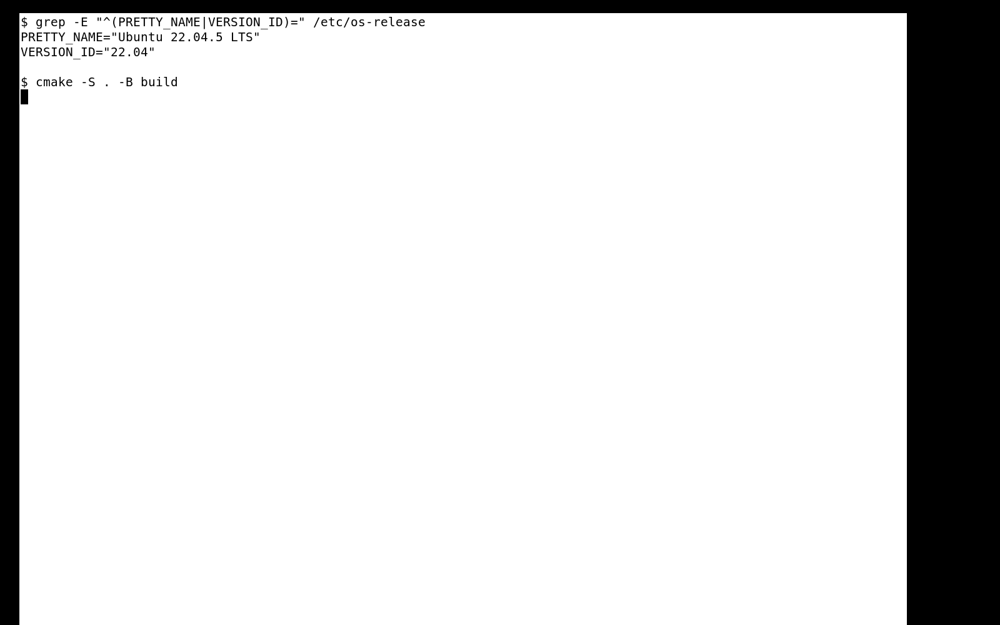

# RoboMaster CMake Hello World

一个使用 C++17 和 CMake 构建的最小 Hello World 项目。程序运行后精确输出：

```text
Hello, RoboMaster!
```

## 环境

- Ubuntu 22.04 LTS
- CMake 3.16 或更高版本
- 支持 C++17 的 C++ 编译器（如 GCC/G++）
- Git

Ubuntu 22.04 可用以下命令安装依赖：

```bash
sudo apt update
sudo apt install -y git cmake build-essential
```

## 获取、构建与运行

```bash
git clone <本仓库公开链接>
cd RoboMaster
cmake -S . -B build
cmake --build build
./build/hello
```

预期输出：

```text
Hello, RoboMaster!
```

## 验证

项目包含 CTest 输出检查：

```bash
ctest --test-dir build --output-on-failure
```

GitHub Actions 会在 Ubuntu 22.04 上从干净检出状态执行配置、构建、测试和运行。

## 目录结构

```text
.
├── .github/workflows/build.yml  # Ubuntu 22.04 自动构建验证
├── images/success.png           # 构建运行成功截图
├── src/main.cpp                # C++ 程序入口
├── .gitignore                  # 排除 build/ 等生成物
├── CMakeLists.txt              # CMake 构建配置
└── README.md                   # 项目说明
```

## 构建成功截图


